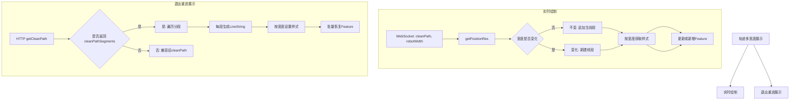
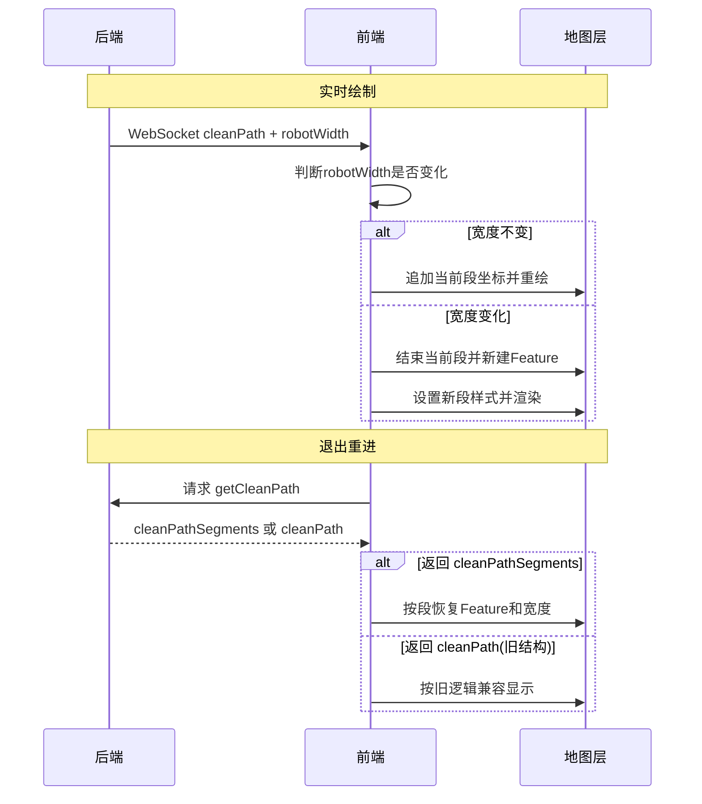

# 实时轨迹多宽度绘制方案

## 一、需求分析

### 当前情况
- 设备实时推送 `robotWidth`（清扫宽度，单位：cm）
- 前端换算关系：`1px = 5cm`
- 换算公式：`centimetreToPixel(val) = val / 100 / 0.05 / scaleX`
- 当前实现：整条轨迹使用统一宽度 `robotPathWidth`

### 需要改动的场景
1. **实时推送点位**：后台继续使用 `robotWidth`，前端按宽度变化分段绘制
2. **退出重进**：清扫中退出重进时，需要恢复之前所有路径及对应的宽度

### 1.1 设计图（实时绘制 vs 退出重进展示）



### 1.2 时序图（后端/前端/地图）



---

## 二、技术方案

### 2.1 数据结构调整

#### 当前数据结构
```javascript
// cleanPathLineFeature 使用 MultiLineString
// 坐标结构：[[[x1, y1], [x2, y2]], [[x3, y3], [x4, y4]]]
cleanPathLineFeature.getGeometry().setCoordinates([
  [[x1, y1], [x2, y2]],  // 第一段线
  [[x3, y3], [x4, y4]]   // 第二段线
])
```

#### 新数据结构（推荐方案）
```javascript
// 方案A：使用多个 Feature，每个 Feature 一个宽度
cleanPathFeatures = [
  {
    feature: Feature(LineString),
    width: 50,  // cm
    pixelWidth: 10  // px
  },
  {
    feature: Feature(LineString),
    width: 60,
    pixelWidth: 12
  }
]

// 方案B：在 Feature 的 properties 中存储宽度信息
feature.set('cleanWidth', 50)  // 存储原始宽度（cm）
feature.set('pixelWidth', 10)  // 存储像素宽度
```

### 2.2 OpenLayers 多宽度线段绘制方案

#### 方案对比

| 方案 | 优点 | 缺点 | 推荐度 |
|------|------|------|--------|
| **方案1：多个Feature** | 每个Feature独立样式，性能好 | 需要管理多个Feature | ⭐⭐⭐⭐⭐ |
| **方案2：动态样式函数** | 灵活，可以根据属性动态计算 | 每次渲染都要计算，性能较差 | ⭐⭐⭐ |
| **方案3：分段LineString** | 结构清晰 | 连接处可能有断点 | ⭐⭐⭐⭐ |

#### 推荐方案：多个 Feature + 样式缓存

```javascript
// 1. 数据结构
data() {
  return {
    cleanPathFeatures: [],  // 存储所有轨迹 Feature
    cleanPathWidthCache: new Map(),  // 宽度样式缓存 Map<width, Style>
    currentCleanPath: {
      coordinates: [],  // 当前段的坐标
      width: null       // 当前段的宽度
    }
  }
}

// 2. 创建样式（带缓存）
getCleanPathStyle(widthInCm) {
  const pixelWidth = this.centimetreToPixel(widthInCm) / this.mapResolution
  
  // 使用缓存避免重复创建
  const cacheKey = `${widthInCm}_${this.mapResolution.toFixed(4)}`
  if (this.cleanPathWidthCache.has(cacheKey)) {
    return this.cleanPathWidthCache.get(cacheKey)
  }
  
  const style = new Style({
    stroke: new Stroke({
      color: '#3C7DF799',
      width: pixelWidth
    })
  })
  
  this.cleanPathWidthCache.set(cacheKey, style)
  return style
}

// 3. 添加新的轨迹段
addCleanPathSegment(coordinate, width) {
  // 如果宽度变化，创建新的 Feature
  if (this.currentCleanPath.width !== width) {
    if (this.currentCleanPath.coordinates.length > 0) {
      // 保存当前段
      this.saveCurrentPathSegment()
    }
    // 开始新段
    this.currentCleanPath.width = width
    this.currentCleanPath.coordinates = [coordinate]
  } else {
    // 继续当前段
    this.currentCleanPath.coordinates.push(coordinate)
  }
}

// 4. 保存当前路径段
saveCurrentPathSegment() {
  if (this.currentCleanPath.coordinates.length < 2) return
  
  const feature = new Feature({
    geometry: new LineString(this.currentCleanPath.coordinates),
    properties: {
      operateType: 'cleanPathLine',
      cleanWidth: this.currentCleanPath.width
    }
  })
  
  feature.setStyle(this.getCleanPathStyle(this.currentCleanPath.width))
  this.cleanPathFeatures.push(feature)
  this.source.addFeature(feature)
}
```

---

## 三、具体改动点

### 3.1 detailMixin.js 改动

#### 改动1：数据结构初始化
```javascript
// 在 data() 中添加
data() {
  return {
    // ... 现有字段
    cleanPathFeatures: [],  // 新增：存储所有轨迹段
    cleanPathWidthCache: new Map(),  // 新增：样式缓存
    currentCleanPath: {  // 新增：当前正在绘制的路径段
      coordinates: [],
      width: null
    }
  }
}
```

#### 改动2：实时推送处理（getPositionRes 方法）
```javascript
// 位置：detailMixin.js 第 250 行左右
getPositionRes(data) {
  // ... 现有代码
  
  if (this.checkAuth('app:main:clean:mapDetail:robotCleanPath')) {
    // ⚠️ 关键改动：实时推送继续使用 robotWidth
    const cleanPath = data?.cleanPath  // [x, y]
    const cleanWidth = data?.robotWidth || 50  // 当前点位宽度（cm）
    
    if (cleanPath?.length) {
      // 新逻辑：根据宽度分段
      this.addCleanPathPoint(cleanPath, cleanWidth)
    } else {
      // 宽度变化或者断开，保存当前段
      if (this.currentCleanPath.coordinates.length > 0) {
        this.saveCurrentPathSegment()
        this.currentCleanPath = { coordinates: [], width: null }
      }
    }
  }
  
  // ... 其他代码
}
```

#### 改动3：退出重进数据恢复（getCleanDataReq 方法）
```javascript
// 位置：detailMixin.js 第 360 行左右
async getCleanDataReq() {
  try {
    if (!this.checkAuth('app:main:clean:mapDetail:robotCleanPath')) return
    
    const res = await getCleanPath(this.$route.query.code)
    
    // ⚠️ 关键改动：后台需要返回新的数据结构
    // 旧结构：res.cleanPath = [[[x1,y1], [x2,y2]], [[x3,y3], [x4,y4]]]
    // 新结构：res.cleanPathSegments = [
    //   { coordinates: [[x1,y1], [x2,y2]], width: 50 },
    //   { coordinates: [[x3,y3], [x4,y4]], width: 60 }
    // ]
    
    if (res?.cleanPathSegments?.length) {
      // 清除旧轨迹
      this.clearAllCleanPaths()
      
      // 恢复所有路径段
      res.cleanPathSegments.forEach(segment => {
        const feature = new Feature({
          geometry: new LineString(segment.coordinates),
          properties: {
            operateType: 'cleanPathLine',
            cleanWidth: segment.width
          }
        })
        feature.setStyle(this.getCleanPathStyle(segment.width))
        this.cleanPathFeatures.push(feature)
        this.source.addFeature(feature)
      })
    }
    
    // 机器人宽度（保持原有逻辑）
    if (res?.robotWidth) {
      this.robotPathWidth = numberFixed(
        this.centimetreToPixel(res.robotWidth),
        0
      )
    }
  } catch (err) {
    console.log(err)
  }
}
```

#### 改动4：新增辅助方法
```javascript
methods: {
  // 新增：添加清扫路径点
  addCleanPathPoint(coordinate, width) {
    // 宽度变化时，保存当前段并开始新段
    if (this.currentCleanPath.width !== null && 
        this.currentCleanPath.width !== width) {
      this.saveCurrentPathSegment()
      this.currentCleanPath = {
        coordinates: [coordinate],
        width: width
      }
    } else {
      // 继续当前段
      if (this.currentCleanPath.coordinates.length === 0) {
        this.currentCleanPath.width = width
      }
      this.currentCleanPath.coordinates.push(coordinate)
      
      // 实时更新当前段（如果已经有Feature）
      if (this.currentCleanPath.feature) {
        this.currentCleanPath.feature.getGeometry()
          .setCoordinates(this.currentCleanPath.coordinates)
      } else if (this.currentCleanPath.coordinates.length >= 2) {
        // 创建新Feature
        const feature = new Feature({
          geometry: new LineString(this.currentCleanPath.coordinates),
          properties: {
            operateType: 'cleanPathLine',
            cleanWidth: width
          }
        })
        feature.setStyle(this.getCleanPathStyle(width))
        this.currentCleanPath.feature = feature
        this.cleanPathFeatures.push(feature)
        this.source.addFeature(feature)
      }
    }
  },
  
  // 新增：保存当前路径段
  saveCurrentPathSegment() {
    if (this.currentCleanPath.coordinates.length < 2) return
    
    // 如果已经有Feature，不需要重复添加
    if (!this.currentCleanPath.feature) {
      const feature = new Feature({
        geometry: new LineString(this.currentCleanPath.coordinates),
        properties: {
          operateType: 'cleanPathLine',
          cleanWidth: this.currentCleanPath.width
        }
      })
      feature.setStyle(this.getCleanPathStyle(this.currentCleanPath.width))
      this.cleanPathFeatures.push(feature)
      this.source.addFeature(feature)
    }
  },
  
  // 新增：获取清扫路径样式（带缓存）
  getCleanPathStyle(widthInCm) {
    const pixelWidth = this.centimetreToPixel(widthInCm) / this.mapResolution
    const cacheKey = `${widthInCm}_${this.mapResolution.toFixed(4)}`
    
    if (this.cleanPathWidthCache.has(cacheKey)) {
      return this.cleanPathWidthCache.get(cacheKey)
    }
    
    const style = new Style({
      stroke: new Stroke({
        color: '#3C7DF799',
        width: pixelWidth
      })
    })
    
    this.cleanPathWidthCache.set(cacheKey, style)
    return style
  },
  
  // 新增：清除所有清扫路径
  clearAllCleanPaths() {
    this.cleanPathFeatures.forEach(feature => {
      this.source.removeFeature(feature)
    })
    this.cleanPathFeatures = []
    this.currentCleanPath = { coordinates: [], width: null, feature: null }
    this.cleanPathWidthCache.clear()
  },
  
  // 修改：清除机器人清扫相关数据
  clearRobotPositionData() {
    this.robotPositionObj.cleanDuration = 0
    this.robotPositionObj.cleanCoverArea = 0
    this.robotPositionObj.cleanProgress = 0
    this.updateMetricsList()
    
    // 新增：清除轨迹
    this.clearAllCleanPaths()
  }
}
```

### 3.2 detail.vue 改动

#### 改动1：移除旧的 cleanPathLineFeature
```javascript
// 位置：detail.vue mounted() 方法
mounted() {
  // ... 其他代码
  
  // ❌ 删除这部分（或注释掉）
  // this.cleanPathLineFeature = new Feature({
  //   id: this.$nanoid(),
  //   properties: {
  //     operateType: 'cleanPathLine'
  //   },
  //   geometry: new MultiLineString([])
  // })
  
  // ... 其他代码
}
```

#### 改动2：地图缩放时更新所有轨迹样式
```javascript
// 位置：detail.vue 第 1760 行左右
handleResolutionChange: debounce(function() {
  this.mapResolution = this.map.getView().getResolution()
  
  // 修改：更新所有清扫路径的样式
  this.cleanPathWidthCache.clear()  // 清除缓存
  this.cleanPathFeatures.forEach(feature => {
    const width = feature.get('cleanWidth')
    if (width) {
      feature.setStyle(this.getCleanPathStyle(width))
    }
  })
  
  // 更新当前正在绘制的段
  if (this.currentCleanPath.feature && this.currentCleanPath.width) {
    this.currentCleanPath.feature.setStyle(
      this.getCleanPathStyle(this.currentCleanPath.width)
    )
  }
}, 50)
```

#### 改动3：样式函数调整（可选）
```javascript
// 位置：detail.vue cleanstylesFunc 方法
// 如果使用多Feature方案，这部分可以简化或删除
// 因为每个Feature已经有自己的样式了
```

---

## 四、后端接口改动需求

### 4.1 实时推送接口（WebSocket）

#### 当前推送数据
```json
{
  "cleanPath": [100, 200],
  "robotWidth": 50,
  "currentMapId": "xxx"
}
```

#### 实时推送保持现状（不新增字段）
```json
{
  "cleanPath": [100, 200],
  "robotWidth": 50,
  "currentMapId": "xxx"
}
```

### 4.2 退出重进接口（HTTP）

#### 当前返回数据
```json
{
  "cleanPath": [
    [[x1, y1], [x2, y2]],
    [[x3, y3], [x4, y4]]
  ],
  "robotWidth": 50
}
```

#### 需要新增结构
```json
{
  "cleanPathSegments": [  // ⚠️ 新增：分段路径数据
    {
      "coordinates": [[x1, y1], [x2, y2]],
      "width": 50  // 该段的宽度（cm）
    },
    {
      "coordinates": [[x3, y3], [x4, y4]],
      "width": 60
    }
  ],
  "robotWidth": 50  // 保留：机器人宽度
}
```

---

## 五、测试方案

### 5.1 功能测试

#### 测试点1：单一宽度绘制
- 设备推送固定宽度（如50cm）
- 验证：轨迹宽度正确显示

#### 测试点2：宽度变化绘制
- 设备推送不同宽度（50cm → 60cm → 70cm）
- 验证：
  - 不同段显示不同宽度
  - 连接处平滑过渡
  - 无断点或重叠

#### 测试点3：地图缩放
- 缩放地图（放大/缩小）
- 验证：
  - 所有轨迹段宽度按比例缩放
  - 相对宽度关系保持正确

#### 测试点4：退出重进
- 清扫中退出
- 重新进入
- 验证：
  - 历史轨迹完整恢复
  - 各段宽度正确
  - 继续推送新点位正常

### 5.2 性能测试

#### 测试场景
- 长时间清扫（1小时+）
- 频繁宽度变化
- 大量轨迹点（10000+）

#### 验证指标
- 内存占用 < 100MB
- 帧率 > 30fps
- 无明显卡顿

### 5.3 边界测试

#### 测试用例
1. 宽度为0或负数
2. 宽度极大值（>1000cm）
3. 快速切换宽度
4. 网络断开重连
5. 地图切换楼层

---

## 六、实施步骤

### 阶段1：验证方案（1天）
1. 创建测试分支
2. 实现基础多宽度绘制
3. 使用模拟数据测试
4. 确认 OpenLayers 绘制效果

### 阶段2：前端改造（2-3天）
1. 修改 detailMixin.js
2. 修改 detail.vue
3. 添加样式缓存优化
4. 本地测试

### 阶段3：后端对接（1-2天）
1. 确认后端接口改动
2. 联调实时推送
3. 联调退出重进

### 阶段4：测试优化（2-3天）
1. 功能测试
2. 性能测试
3. 边界测试
4. 优化调整

---

## 七、风险与注意事项

### 7.1 技术风险
1. **性能问题**：大量Feature可能影响渲染性能
   - 缓解：使用样式缓存、限制Feature数量
   
2. **连接处断点**：不同Feature之间可能有视觉断点
   - 缓解：确保相邻段首尾坐标重合

3. **地图缩放卡顿**：缩放时需要更新所有Feature样式
   - 缓解：使用防抖、批量更新

### 7.2 兼容性风险
1. **旧数据兼容**：需要兼容旧版本数据结构
2. **后端延迟**：后端改动可能延迟
   - 缓解：实时推送无需新增字段，直接使用 robotWidth；仅退出重进接口新增分段结构

### 7.3 注意事项
1. 单位统一：后端统一使用 cm
2. 换算精度：保持现有换算公式不变
3. 样式缓存：注意清理缓存时机
4. 内存管理：长时间运行需要考虑Feature数量限制

---

## 八、降级方案

如果多Feature方案性能不佳，可以降级为：

### 方案B：动态样式函数
```javascript
// 使用单个 MultiLineString + 动态样式
feature.setStyle((feature, resolution) => {
  const coordinates = feature.getGeometry().getCoordinates()
  // 根据坐标段返回不同样式
  // 缺点：性能较差，不推荐
})
```

### 方案C：Canvas 自定义渲染
```javascript
// 使用 Canvas 直接绘制
// 优点：完全控制
// 缺点：实现复杂，失去 OpenLayers 优势
```

---

## 九、总结

### 推荐方案
**多Feature + 样式缓存**

### 核心改动
1. 数据结构：从单个 MultiLineString 改为多个 LineString Feature
2. 实时推送：后端继续推送 `robotWidth`，前端按宽度变化分段
3. 退出重进：后端需要返回 `cleanPathSegments` 结构
4. 样式管理：使用 Map 缓存样式对象

### 优势
- 性能好：每个Feature独立样式，避免重复计算
- 灵活：支持任意宽度变化
- 可维护：代码结构清晰

### 工作量评估
- 前端：3-4天
- 后端：2-3天
- 测试：2-3天
- 总计：7-10天
